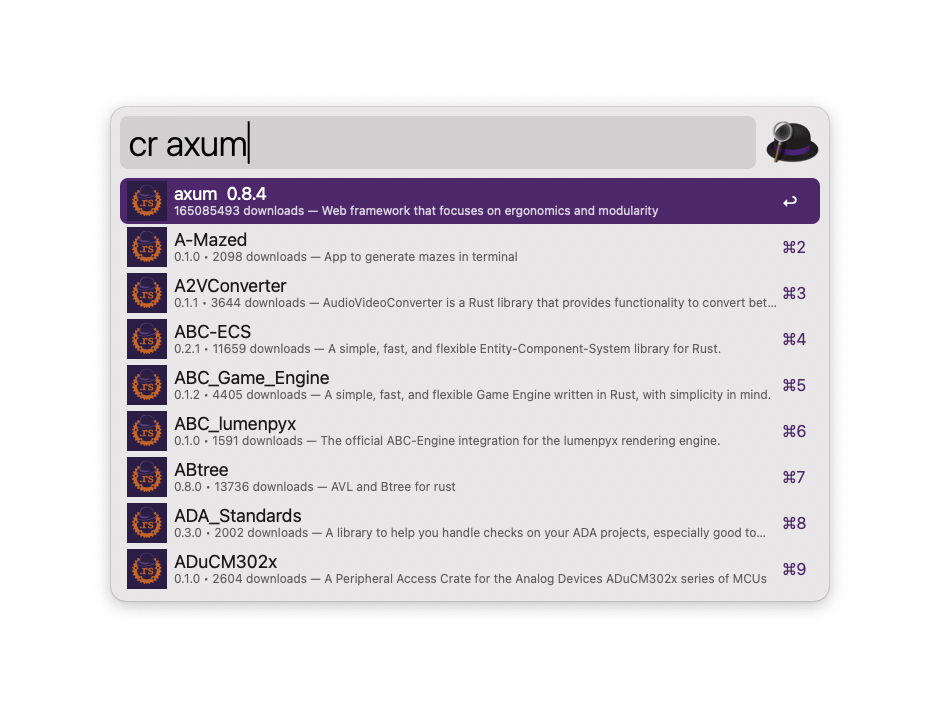

# Crates (Rust) — Alfred Workflow

  

🔎 Search [crates.io](https://crates.io) packages directly from [Alfred](https://www.alfredapp.com/).
Quickly check the latest version, open documentation, or copy install commands.

---

## ✨ Features

- `cr <crate>` — search crates.io
- Shows **latest version**, **description**, and **download count**
- **Enter** → Open [docs.rs](https://docs.rs)
- **⌘-Enter** → Open crate on [crates.io](https://crates.io)
- **⌥-Enter** → Copy `cargo add <crate>@<version>`
- **⇧-Enter** → Copy `<crate> = "<version>"` (Cargo.toml)

---

## 📦 Installation

1. [Download the latest release](https://github.com/azat-rs/alfred-crates/releases/latest).
2. Double-click the `.alfredworkflow` file to install.
3. Requires **Alfred 5 with Powerpack**.

---

## 🛠 Requirements

- macOS
- Alfred 5 with Powerpack
- Internet connection (fetches metadata from crates.io API)

---

## 📸 Screenshots

---

## 📄 License

MIT © Azat (azataiot)
